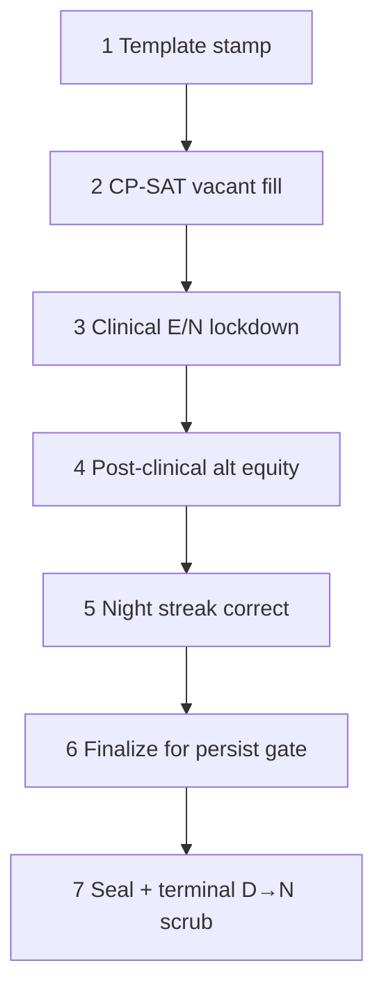

# Portage auto_generate pipeline

This document maps the **STANDARD** (8-hour Portage) schedule generation path in
[`src/lab_scheduler/scheduling/auto_generate.py`](src/lab_scheduler/scheduling/auto_generate.py).
The file is large (~19k lines) because each phase is a separate pass accumulated over time.

For **TWELVE_HOUR** schedules, see [`deterministic_stamper.py`](src/lab_scheduler/scheduling/deterministic_stamper.py) — that path bypasses this pipeline entirely.

## Entry points

| Function | Role |
|----------|------|
| `auto_generate_schedule()` | Routes to `generate_schedule_for_archetype()` |
| `_generate_portage_schedule()` | Main Portage STANDARD body |
| `_seal_portage_generate_result()` | Last-mile dedupe, catalog seal, metrics |

## Phase order (happy path)

### 1. Template stamp — `_propagate_portage_template`

- **Input:** roster, 8-week master catalog per line (`portage_template.py` / `portage_dn_reference.json`)
- **Output:** `PlannedAssignment` rows; vacant lines get `master_template_frozen=True`
- **Notes:** Named staff skip weekend catalog cells; vacant full-time D/N lines stamp weekends
- **D→N risk:** Catalog tokens with adjacent D then N (mitigated by transition-safe catalog lookup)

### 2. CP-SAT vacant fill — `_run_cpsat_vacant_fill_pass`

- **Input:** Unfilled demand slots, vacant line hour deficits
- **Output:** Additional assignments from OR-Tools solver (`solver/cpsat_fill.py`)
- **D→N risk:** Low — solver uses same labor rule predicates

### 3. Clinical evening/night lockdown — `_extend_evening_night_clinical_lockdown`

- **Input:** Unfilled 2E/2N clinical seats per day
- **Output:** Mandatory clinical placements via `_run_clinical_seat_lockdown_pass`
- **D→N risk:** **Medium** — can place weekend **N** after weekday **D** on named D/N lines

### 4. Post-clinical alt equity — `_post_clinical_alt_equity_pass`

- **Input:** Assignment state after clinical fill
- **Output:** Peer day swaps for alternate-band (E) equity among full-time lines
- **Policy:** Only runs when `CLINICAL_AND_HOURS_FIRST` is active (default)
- **D→N risk:** Low — swaps D/E bands, not night blocks

### 5. Night streak correction — `correct_portage_night_streaks` / `trim_consecutive_night_overruns`

- **Module:** `night_streak_corrector.py`
- **Output:** Shortens illegal consecutive night runs (>4)

### 6. Finalize for persist gate — `_finalize_for_persist_gate` → `_clinical_first_finalize`

Iterative loop of trim → catalog restore → clinical heal → **D→N resolve** → preflight violations.

Key sub-passes inside `_run_persist_preflight_pass`:

| Pass | Function | Purpose |
|------|----------|---------|
| Trim surplus | `_trim_catalog_contract_surplus`, `_trim_parttime_*` | Remove hour overruns |
| Catalog restore | `_restore_missing_catalog_master_assignments` | Re-stamp frozen master cells |
| Coverage heal | `_force_fill_all_remaining_slots`, `_extend_evening_night_clinical_lockdown` | Close demand gaps |
| Transition heal | `_deterministic_resolve_day_night_transitions` | Remove/rehome illegal D→N pairs |
| Preflight | `_persist_preflight_violations` | Block persist if core violations |

**D→N risk:** **High** — catalog restore and clinical heal run *before* mid-loop transition resolve; frozen cells were previously immune to removal

### 7. Seal — `_seal_portage_generate_result`

- Dedupe assignments
- `_enforce_dn_fulltime_master_catalog` — force D/N catalog fidelity
- **Terminal `_deterministic_resolve_day_night_transitions(dn_only=True)`** — last scrub before export
- Refresh coverage tier metrics

## Validation layers (different lifecycle stages)

| Stage | Module | Blocks |
|-------|--------|--------|
| Per-assignment | `_would_violate_labor_rules` | Incremental adds during generation |
| Post-build | `audit/compliance.ComplianceValidator` | Master compliance gate |
| Pre-persist | `persist_validation.find_core_persist_violations` | DB write / breakroom export |
| Fairness report | `validation/staff_fairness_report.py` | Manager-facing diagnostics |

Hard rule **Day → Night** on consecutive calendar days:

- Defined: `engine/demand.py` → `asymmetric_shift_transition_violation`
- Scanned: `find_day_night_transition_violations`
- Persist code: `DAY_NIGHT_TRANSITION` (in `persist_validation.py`)

## Passes that can reintroduce D→N after healing

1. `_enforce_dn_fulltime_master_catalog` — re-stamps catalog cells
2. `_restore_missing_catalog_master_assignments` — adds missing frozen rows
3. `_extend_evening_night_clinical_lockdown` — adds E/N for coverage
4. `_enforce_weekend_shift_mirror` — pairs Sat/Sun (checks labor rules)

The **terminal seal scrub** (phase 7) exists specifically to catch leaks from passes 1–3.

## Disabled / legacy passes (see DEAD_CODE.md)

- `_realign_dn_night_assignments` — returns 0 immediately
- `_post_generate_portage_equity_and_caps` — no-op under default policy

## Related files

| File | Role |
|------|------|
| `portage_dn_reference.json` | Screenshot-derived 8-week D/N grids |
| `portage_template.py` | Catalog spec + `vacant_master_scheduled_shift_code` |
| `clinical_seats.py` | Mandatory E/N candidate ranking |
| `persist_validation.py` | Export/persist hard gate |
| `auto_pilot.py` | UI wrapper; adaptive strict → preview ladder |
