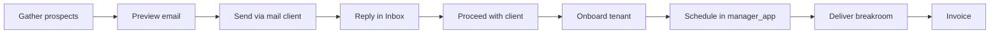

# One-Stop Shop Vision — Lab Staffing Scheduler Business Cockpit

**Date:** 2026-06-19  
**North star:** $2,000 CAD/month MRR ([REVENUE_2000_PLAN.md](./REVENUE_2000_PLAN.md))  
**Operator goal:** One app where you gather prospects, send outreach, capture replies, onboard clients, deliver breakroom schedules, and invoice — without juggling Gmail, spreadsheets, and ad-hoc notes.

---

## User journey (end to end)

| Step | Where in app | What happens | Human vs automated |
|------|----------------|--------------|-------------------|
| **1. Gather** | Business → Pipeline / Prospects | Auto-scan Manitoba hospital labs from `regional_facilities.csv`; ICP score + pain signals | **Automated** scan; **human** picks targets |
| **2. Preview** | Business → Email Preview | Personalized draft; honesty check; save draft | **Human** edits tone and claims |
| **3. Send** | Email Preview → mail client | `mailto:` opens Gmail/Outlook; **Reply-To** set to monitored inbox | **Human** sends (no auto-send by design) |
| **4. Reply lands in Inbox** | Business → **Inbox** | IMAP sync or manual log; match to prospect; Pipeline **Replied** column | **Automated** match + sync; **human** reads and acts |
| **5. Proceed** | Inbox or Email Preview | Proceed with client → tenant + onboarding checklist | **Human** confirms engagement type |
| **6. Onboard** | Client Onboarding | Roster CSV, period, distribute/fill/save tasks | **Human** operator + **automated** tenant seed |
| **7. Schedule** | `manager_app.py` | Build 8-week schedule, RSI gate, publish | **Human** judgment on edge cases; **automated** rules engine |
| **8. Deliver breakroom** | Export HTML | Client-ready breakroom grid | **Automated** export; **human** delivery email |
| **9. Invoice** | Onboarding checklist / future billing | First managed block ($800–1,200 CAD) then Pro ($299/mo) | **Human** invoice today; **Phase 2** Stripe |

---

## Inbound email architecture (MVP)

### SQLite: `business_inbound_messages`

Stores synced or manually logged replies with optional `prospect_id`, thread metadata, and `unread` / `read` / `archived` status.

### IMAP sync (`src/lab_scheduler/business/inbound_email.py`)

Polls the monitored mailbox when env vars are set:

| Variable | Purpose |
|----------|---------|
| `LAB_INBOUND_IMAP_HOST` | e.g. `imap.gmail.com`, `outlook.office365.com` |
| `LAB_INBOUND_IMAP_USER` | Monitored inbox address |
| `LAB_INBOUND_IMAP_PASSWORD` | App password (never commit to repo) |
| `LAB_INBOUND_IMAP_FOLDER` | Default `INBOX` |
| `LAB_INBOUND_REPLY_TO` | Optional; used in outbound mailto Reply-To |

**Matching rules:** sender email → prospect email; subject ↔ saved draft subject; facility name in subject; In-Reply-To thread chain.

When matched: prospect status bumps to `contacted`; card appears in Pipeline **Replied** column.

### Graceful degradation

- IMAP not configured → Inbox shows setup instructions + **Log reply manually**
- Outbound still works via mailto; operator pastes replies until IMAP is live

### Connecting Gmail

1. Google Account → Security → 2-Step Verification → **App passwords**
2. Create app password for Mail
3. Gmail Settings → Forwarding and POP/IMAP → Enable IMAP
4. Set env vars; restart app; Business → Inbox → **Sync inbox**

### Connecting Outlook / Microsoft 365

1. Outlook settings → Mail → Sync email → enable IMAP
2. If MFA enabled, create an app password in Microsoft account security
3. Host: `outlook.office365.com`; user: full email; password: app password
4. Sync from Inbox tab

---

## What requires human judgment

- Choosing which prospects to email and when to pass
- Editing outreach copy and verifying facility-specific claims
- Clicking Send in the mail client (intentional — no bulk auto-send)
- Deciding Proceed vs Pass after reading a reply
- Roster quality, union edge cases, and publish sign-off in manager_app
- Pricing conversation and first invoice

## What is automated today

- Prospect discovery and ICP scoring
- Email draft generation and draft persistence
- Inbound deduplication by Message-ID
- Prospect matching on reply
- Tenant creation on Proceed
- Onboarding task tracking
- Schedule generation, RSI gate, breakroom HTML export

---

## Phase 2 (post-MVP)

| Capability | Value |
|------------|--------|
| **Calendar** | Book demo calls from Inbox; sync Google/Outlook calendar |
| **Contracts** | Managed block + retainer templates; e-sign |
| **Stripe invoices** | Auto invoice on onboarding milestone; MRR dashboard from live billing |
| **Outbound tracking** | Store sent Message-ID; tighter In-Reply-To threading |
| **Push notifications** | Desktop/mobile alert on new Inbox reply |

---

## Success metric

You know the one-stop shop is working when:

1. Every prospect reply appears in **Business → Inbox** within one sync (or manual log)
2. Pipeline **Replied** column shows who needs a follow-up
3. You never search Gmail for "breakroom scheduling" to find a warm lead
4. Proceed → Onboard → manager_app → breakroom export happens without leaving the product ecosystem

See [REVENUE_2000_PLAN.md](./REVENUE_2000_PLAN.md) for weekly execution tasks toward $2,000 CAD/mo.
